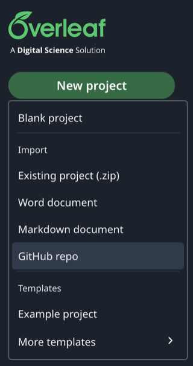

<p align="center">
  
</p>

<h1 align="center">Semester Project Proposal Template</h1>
<p align="center"><em>"Artificial Intelligence" Course — Ukrainian Catholic University</em></p>

<p align="center">
  <a href="LICENSE"></a>
</p>

A LaTeX template for writing your semester project proposal.

## Three ways to use this template

Options 1 and 2 both run in Overleaf (no local install needed); option 3
compiles on your own machine.

### Option 1: Overleaf via GitHub sync

Best if your team already uses GitHub — keeps Overleaf and your repo
in sync in both directions as you edit.

1. Get your own copy of this repository on GitHub (fork it, or use
   GitHub's "Use this template" button).
2. In Overleaf, go to **New Project → GitHub repo**. The first time you
   do this, Overleaf will ask you to connect/authorize your GitHub
   account:

   

   If you get stuck authorizing the connection, see
   [Overleaf's GitHub sync docs](https://docs.overleaf.com/integrations-and-add-ons/git-integration-and-github-synchronization/github-synchronization)
   and
   [GitHub's OAuth app docs](https://docs.github.com/en/apps/oauth-apps/using-oauth-apps/installing-an-oauth-app-in-your-personal-account#installing-an-oauth-app-in-your-personal-account).
3. Pick your repository from the list and click **Import to Overleaf**:

   
4. Overleaf compiles `main.tex` from the repo. Edit, recompile, and use
   Overleaf's GitHub sync panel to push your commits back when you're
   done — that keeps your GitHub repo (and the course's record of your
   work) up to date.

### Option 2: Overleaf via zip upload

Package the template into a zip yourself and
upload it directly. There's no sync with this option: re-run the same
command and re-upload whenever you want to update the Overleaf copy.

**macOS / Linux:**
```bash
zip -r proposal.zip main.tex ucuproposal.cls references.bib .latexmkrc assets
```

**Windows (PowerShell):**
```powershell
Compress-Archive -Path main.tex, ucuproposal.cls, references.bib, .latexmkrc, assets -DestinationPath proposal.zip
```

Then in Overleaf: **New Project → Existing project (.zip)**, and upload
`proposal.zip`.

The same `proposal.zip` also works for importing into
[Prism](https://openai.com/prism/), if you'd rather use that.

### Option 3: Compile locally

Install a XeLaTeX-capable TeX distribution plus Biber, then use
`latexmk` (already configured for XeLaTeX + Biber via `.latexmkrc`, no
extra flags needed).

**macOS:**
```bash
brew install --cask mactex   # full distribution (~5 GB) -- simplest option
```
Lighter alternative: `brew install --cask basictex`, then install
whatever `latexmk` complains is missing with `tlmgr install <package>`.

**Windows:**
Install [MiKTeX](https://miktex.org/download) and leave "Install missing
packages on the fly" enabled (on by default) — it fetches what it needs
the first time you compile. [TeX Live](https://tug.org/texlive/windows.html)
is a full-up-front alternative if you'd rather not install packages
on demand.

**Linux (Debian/Ubuntu):**
```bash
sudo apt install texlive-xetex texlive-latex-extra texlive-fonts-extra \
  texlive-lang-cyrillic texlive-bibtex-extra biber latexmk
```

Commands to know, once installed:
```bash
latexmk main.tex   # compile (XeLaTeX + Biber)
latexmk -c         # remove build artifacts, keep the PDF
latexmk -C         # remove build artifacts AND the PDF -- do a full clean
                    # rebuild with this if something looks stale/broken,
                    # e.g. after pulling changes to ucuproposal.cls
```

If Charis SIL or Fira Sans aren't installed, the class automatically
falls back to DejaVu and warns about it in the compilation log (see
[Fonts](#fonts) below) — you don't need to hunt down the exact font
packages yourself.

## What you can and cannot change

**Don't change**: fonts, page margins, font sizes, colors, the structure
and order of the title page elements, or the `ucuproposal.cls` file. All
of this already follows UCU's brand guidelines and has been verified.

**Don't delete sections** of the main text, even if one seems irrelevant
to your project — in that case, write one sentence explaining why it
doesn't apply.

**Do edit**: only the text and metadata in `main.tex` (title, team,
mentor, track, repository, date, section content) and `references.bib`.

## Changing the language

The document language is a class option on the first line of `main.tex`:

```latex
\documentclass[ukrainian]{ucuproposal}   % default
\documentclass[english]{ucuproposal}
```

This switches the language of everything the class controls: the title
page labels ("Team" / "Команда", "Mentor" / "Ментор", etc.), the
"submitted for the course..." line, the running header/footer, hyphenation
(via `polyglossia`), and the PDF's `pdflang` metadata.

It does **not** translate your own content — the section text in
`main.tex` and the entries in `references.bib` stay whatever language you
typed them in. Pick the class option that matches the language you're
writing in, so the labels and your text agree (don't mix an
`[english]`-class document with Ukrainian section text, or vice versa).

Options can be combined with a comma, e.g. `[english,slogan]`. See
[`example/example.tex`](example/example.tex) for a fully filled-in
`[english]` example.

Note: the UCU seal and Faculty of Applied Sciences logo on the title page
currently only exist as English-language image files, so they'll show
English text even in `[ukrainian]` mode until Ukrainian-language versions
are added to `assets/logo/`.

## Scope

Title page (1) + main text (1–2) + list of references (no limit) =
3 pages of core material maximum. If the main text exceeds 2 pages,
compilation **does not fail**, but the log will show a warning:
`WARNING: Основний текст перевищує 2 сторінки`. Trim the text until the
warning disappears.

## Fonts

Body text — **Charis SIL**, headings and title page — **Fira Sans**.
Both are included in standard TeX Live (packages `charissil` and `fira`)
and available in Overleaf with no extra setup. If a typeface isn't
installed, the class **explicitly warns about it in the compilation log**
and falls back to a substitute font (`DejaVu Serif` / `DejaVu Sans`) —
there's no silent substitution.

## Tip

Check that the template compiles without errors or warnings **a week
before the deadline** — this leaves time to fix things if something goes
wrong (e.g. you forgot one of the required title page elements).

## Example

A fully filled-in (fictional) example is in the [`example/`](example/)
folder: [`example.tex`](example/example.tex) and the compiled
[`example.pdf`](example/example.pdf).

## Contributing

Stars and forks are welcome. Found a bug in the template? PRs are
welcome too.

## License

MIT — see [LICENSE](LICENSE).
